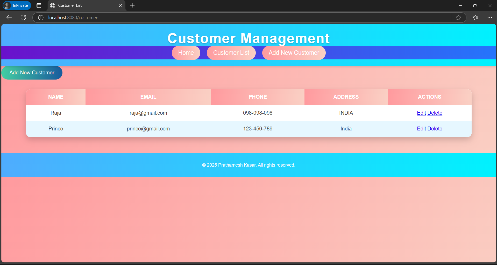

# Customer Relationship Manager (CRM)

A simple Customer Relationship Management system built using **Spring Boot**, **Spring Data JPA**, and **Thymeleaf**. This application allows users to manage customer information, including adding, editing, listing, and deleting customer records.

---

## Features
- View all customers
- Add new customers
- Edit existing customers
- Delete customers
- Integrated with MySQL for persistent storage
- H2 console for database debugging
- RESTful API endpoints

---

## Technologies Used
- **Spring Boot**: Application framework
- **Spring Data JPA**: Database integration
- **Thymeleaf**: Templating engine
- **MySQL**: Relational database
- **H2 Database**: Embedded database for development
- **Tomcat**: Embedded web server

---

## Prerequisites
1. Java Development Kit (JDK 17 or higher)
2. Maven (or an IDE with Maven support, like IntelliJ IDEA or Eclipse)
3. MySQL installed locally or accessible remotely

---

## Installation

### Step 1: Clone the Repository
    
```bash
    git clone https://github.com/01Prathamesh/customer-relationship-manager.git
    cd customer-relationship-manager
```

### Step 2: Configure the Database

Update the src/main/resources/application.properties file with your MySQL credentials:
```bash
    spring.datasource.url=jdbc:mysql://localhost:3306/crm_db?useSSL=false&serverTimezone=UTC
    spring.datasource.username=your_mysql_username
    spring.datasource.password=your_mysql_password
    spring.jpa.hibernate.ddl-auto=update
    spring.jpa.open-in-view=true
    spring.h2.console.enabled=true
```


### Step 3: Build and Run the Application
    
1. Build the project:
    ```bash
    mvn clean install
    ```

2. Run the application:
    ```bash
    mvn spring-boot:run
    ```
    
3. Alternatively, you can run the application from your IDE by executing the CustomerRelationshipManagerApplication class.

---

## Usage
Access the Application
Open your browser and go to:
```bash
http://localhost:8080/
```

---

## Endpoints

| Endpoint               | Description                                  |
|------------------------|----------------------------------------------|
| `/`                    | Home Page                                   | 
| `/customers`           | View all customers                          |
| `/customers/new`       | Add a new customer                          |
| `/customers/edit/{id}` | Edit an existing customer                   |
| `/customers/delete/{id}` | Delete a customer                         |
| `/h2-console`          | Access the H2 database console (dev)        |
| `/faq`                 | Frequently Asked Questions (placeholder)    |
| `/about`               | About the CRM application                   |

---

## Project Structure
```bash
src/main/java
└── com.crm.crm
    ├── controller
    │   └── CustomerController.java  # Handles HTTP requests
    ├── model
    │   └── Customer.java            # Customer entity
    ├── repository
    │   └── CustomerRepository.java  # Database access layer
    ├── service
    │   └── CustomerService.java     # Business logic layer
    └── CustomerRelationshipManagerApplication.java # Main class

src/main/resources
├── application.properties           # Application configuration
├── templates
│   ├── customer-list.html           # Template for customer list
│   └── customer-form.html           # Template for add/edit form
└── static              

SS
├── 1.png                            # Home page screenshot
├── 2.png                            # Another home page view
├── 3.png                            # Customer list page screenshot
└── 4.png                            # Customer form page screenshot
```

---

## Database
### Schema
#### Table: customers
```
- id (Primary Key, Auto Increment)
- name (String, Non-Null)
- email (String, Non-Null)
- phone (String, Non-Null)
- address (String)
```

### Accessing the H2 Console
1. Go to:
```bash
http://localhost:8080/h2-console
```
2. Use the following details to log in:
- JDBC URL: jdbc:mysql://localhost:3306/crm_db?useSSL=false&serverTimezone=UTC
- Username: Same as configured in application.properties.
- Password: Same as configured in application.properties.

---

## Common Issues

### Error: `java.lang.ClassNotFoundException: com.crm.crm.CustomerRelationshipManagerApplication`
- Ensure the `CustomerRelationshipManagerApplication.java` class is in the correct package (`com.crm.crm`).

### Error: `Database not found`
- Ensure MySQL is running, and the `crm_db` database exists.

### Debugging Database Issues
- Use the H2 console to verify data in development mode.

---

## License

This project is licensed under the [MIT License](LICENSE).

---

## Code of Conduct

This project adheres to the [Contributor Covenant Code of Conduct](CODE_OF_CONDUCT.md). By participating, you are expected to uphold this code. Please report unacceptable behavior to [prathameshkasar.work@gmail.com](mailto:prathameshkasar.work@gmail.com).

---

## Reporting Issues

If you encounter any issues or have suggestions for improvement, feel free to open an issue on [GitHub](https://github.com/01Prathamesh/Customer-Relationship-Manager/issues).


<!-- ## Screenshots

| Screenshot                      | Description               |
|---------------------------------|---------------------------|
|           | Home page view 1          |
|           | Home page view 2          |
|       | Customer list page        |
|       | Customer form page        | -->

---

## Acknowledgments

- **Spring Boot Documentation**: [spring.io](https://spring.io)
- **Thymeleaf Documentation**: [thymeleaf.org](https://www.thymeleaf.org)


## Screenshots

I have added the following screenshots to demonstrate the different pages of the CRM application:

1. **Home Page Screenshot 1**:
   - 

2. **Home Page Screenshot 2**:
   - 

3. **Customer List Page Screenshot**:
   - 

4. **Customer Form Page Screenshot**:
   - 

These screenshots are stored in the `SS` folder located at the root of the project.

---